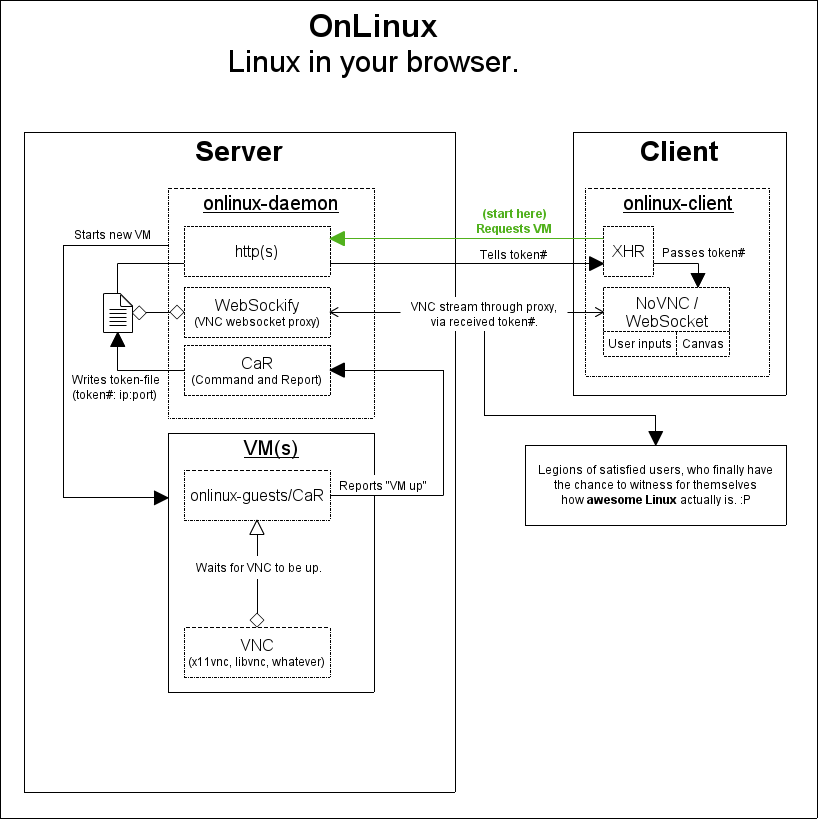

# OnLinux Daemon

[VirtualBox](https://www.virtualbox.org/)-[NodeJS](https://nodejs.org/)-[WebSockify](https://github.com/kanaka/websockify)-[NoVNC](https://kanaka.github.io/noVNC/) stack, bringing various Linux distributions to your browser.

### Demos
[First steps with NoVNC](https://youtu.be/yKUG5gmwEU4)

[Beta UI](https://youtu.be/dBC9qVNAyDI)

